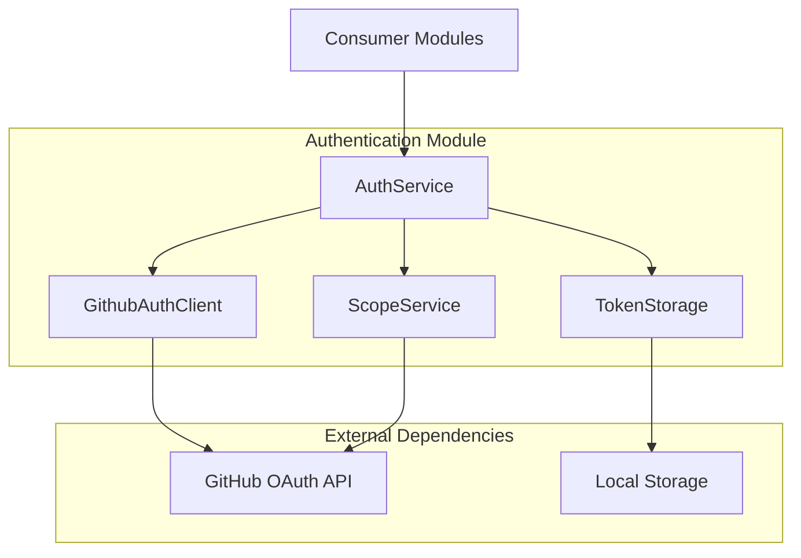
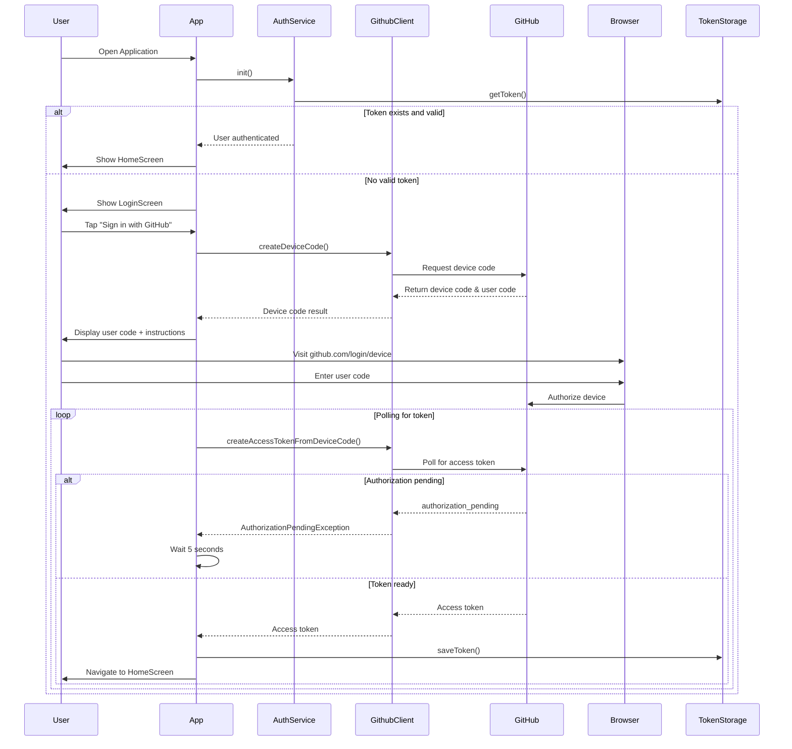

# Design Document

## Overview

The GitHub Client Authentication system implements GitHub's OAuth device flow for secure authentication without requiring users to enter credentials directly on mobile devices. The design focuses on the core authentication services, token management, and error handling required for secure GitHub API access.

The system provides a clean separation between authentication concerns and application logic, allowing other modules to consume authentication services through well-defined interfaces.

## Architecture

### High-Level Architecture



### Module Interface

The authentication module exposes a single primary interface:
- **AuthService**: Main authentication orchestrator consumed by other modules
- **Service Registration**: Authentication services registered with dependency injection for consumption
- **Token Access**: Provides authenticated HTTP client and token validation for API calls

### Authentication Flow



## Components and Interfaces

### Service Layer

#### AuthService
- **Purpose**: Central authentication management
- **Responsibilities**:
  - Initialize and validate stored tokens
  - Orchestrate the device flow authentication
  - Manage login/logout state
  - Validate token scopes
- **Dependencies**: GithubAuthClient, ITokenStorage, IScopeService
- **Key Methods**:
  - `init()`: Load and validate stored token
  - `login()`: Full device flow authentication
  - `loginWithDeviceCode(String)`: Continue authentication with existing device code
  - `logout()`: Clear authentication state

#### GithubAuthClient
- **Purpose**: Direct interface to GitHub OAuth API
- **Responsibilities**:
  - Request device codes from GitHub
  - Poll for access tokens
  - Handle GitHub-specific error responses
- **Dependencies**: http.Client, GitHub Client ID
- **Key Methods**:
  - `createDeviceCode(List<String> scopes)`: Request device authorization
  - `createAccessTokenFromDeviceCode(String)`: Poll for access token
- **Exception Handling**:
  - `AuthorizationPendingException`: User hasn't authorized yet
  - `SlowDownException`: Rate limiting from GitHub
  - `AccessDeniedException`: User denied authorization
  - `GithubNonRecoverableException`: Permanent errors

#### TokenStorage (ITokenStorage)
- **Purpose**: Secure token persistence
- **Responsibilities**:
  - Store access tokens securely
  - Retrieve stored tokens
  - Clear tokens on logout
- **Implementation**: Uses SharedPreferences for local storage

#### ScopeService (IScopeService)
- **Purpose**: Token scope validation
- **Responsibilities**:
  - Extract scopes from access tokens
  - Validate required scopes are present
- **Required Scopes**: `['repo', 'read:user']`

### ViewModel Layer

#### AuthViewModel
- **Purpose**: Global authentication state management
- **Responsibilities**:
  - Expose authentication state to GoRouter
  - Handle app initialization
  - Manage logout flow
  - Notify UI of authentication changes
- **State Properties**:
  - `loading`: App initialization state
  - `loggedIn`: Current authentication status
- **Integration**: Extends ChangeNotifier for GoRouter refresh

#### LoginViewModel
- **Purpose**: Login screen state management
- **Responsibilities**:
  - Handle device flow UI states
  - Display user codes and instructions
  - Manage login progress and errors
  - Coordinate with AuthService for authentication
- **State Properties**:
  - `isLoading`: Login process state
  - `userCode`: Code for user to enter on GitHub
  - `errorMessage`: Authentication error feedback

### Public API

#### AuthService Interface
The primary interface for consuming modules:
```dart
class AuthService {
  Future<void> init();
  Future<void> login();
  Future<void> loginWithDeviceCode(String deviceCode);
  Future<void> logout();
  bool get isAuthenticated;
  String? get accessToken;
}
```

#### Authentication Events
The service provides state change notifications:
- **Authentication Status**: Observable changes to login state
- **Token Updates**: Notifications when tokens are refreshed or invalidated
- **Error Events**: Authentication failures and recovery states

## Data Models

### GithubDeviceCodeResult
```dart
class GithubDeviceCodeResult {
  String deviceCode;  // Used for polling GitHub
  String userCode;    // Displayed to user for manual entry
}
```

### Authentication State
- Managed internally by AuthService
- Persisted via TokenStorage interface
- Validated against required scopes (`repo`, `read:user`)
- Exposed to consumers through observable properties

### Exception Hierarchy
```
GithubAuthException (base)
├── GithubRecoverableException
│   ├── AuthorizationPendingException
│   ├── SlowDownException
│   └── AccessDeniedException
└── GithubNonRecoverableException
```

## Error Handling

### Authentication Errors
- **Authorization Pending**: Continue polling with 5-second delays
- **Slow Down**: Increase polling interval to 10 seconds
- **Access Denied**: Display error and allow retry
- **Non-recoverable**: Display error details and stop process

### Network Errors
- HTTP client errors are caught and converted to user-friendly messages
- Token validation failures result in automatic logout
- Browser launch failures are logged but don't crash the app

### Service Errors
- Graceful degradation for network failures
- Automatic token cleanup on validation failures
- Proper resource disposal in service lifecycle

## Testing Strategy

### Unit Testing
- **Services**: Mock HTTP client and storage dependencies
- **Authentication Flow**: Test all exception scenarios
- **Token Management**: Verify storage, retrieval, and validation

### Integration Testing
- **Device Flow**: End-to-end authentication testing
- **Token Persistence**: Verify storage and retrieval across app restarts
- **Service Integration**: Test service interactions and error propagation

### Module Testing
- **Public API**: Test all exposed service methods
- **Error Scenarios**: Verify proper exception handling and recovery
- **State Consistency**: Ensure authentication state remains consistent

## Security Considerations

### Token Security
- Access tokens stored in SharedPreferences (platform secure storage)
- Tokens validated on app start and periodically
- Automatic cleanup of invalid tokens

### OAuth Security
- Uses GitHub's recommended device flow for mobile apps
- Required scopes explicitly defined and validated
- No client secrets stored in mobile app

### Error Information
- Sensitive error details not exposed to UI
- Generic error messages for user-facing components
- Detailed logging for development debugging

## Performance Considerations

### Authentication Flow
- Efficient polling with appropriate delays
- Token validation only on app start and when needed
- Minimal network requests during normal operation

### UI Responsiveness
- Async operations don't block UI thread
- Loading states provide user feedback
- Proper state management prevents unnecessary rebuilds

### Memory Management
- ViewModel listeners properly disposed
- HTTP client reused across requests
- Minimal object creation in hot paths