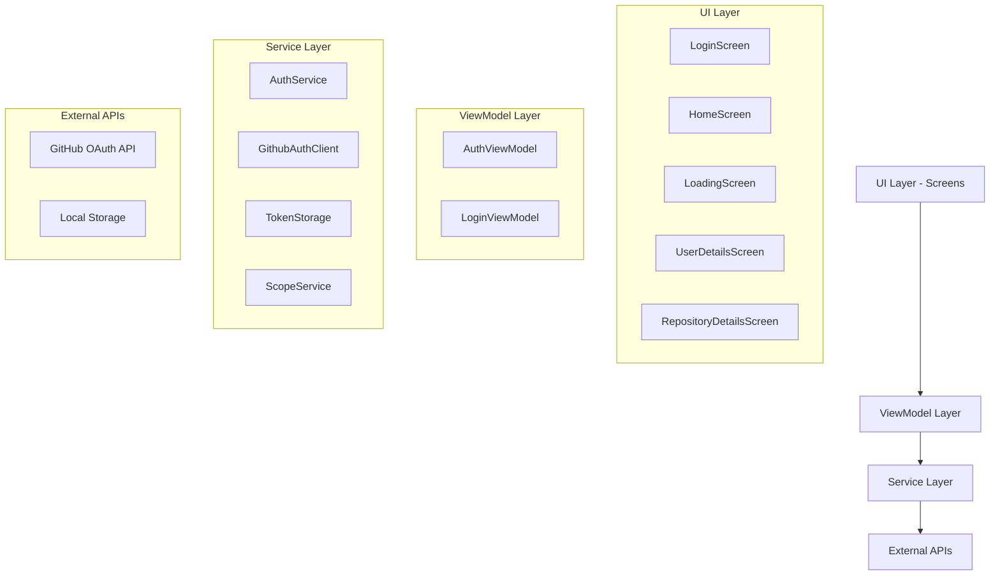
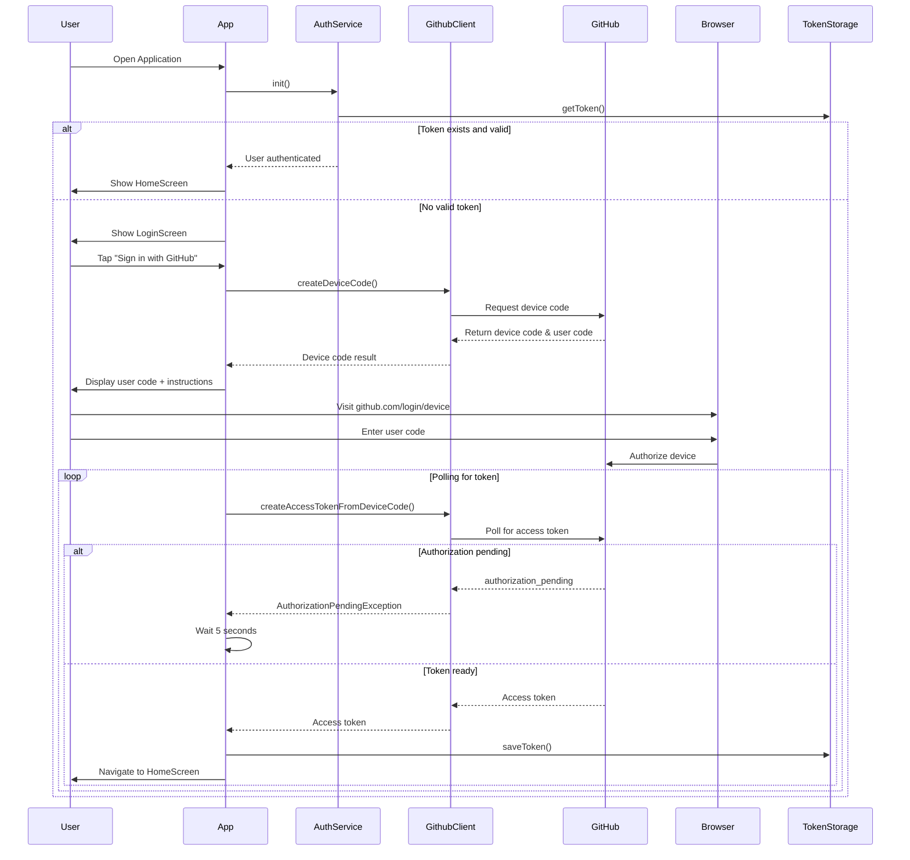

# Design Document

## Overview

The GitHub Client Authentication system is built using Flutter with a clean architecture approach that separates concerns between services, ViewModels, and UI components. The system implements GitHub's OAuth device flow for secure authentication without requiring users to enter credentials directly on mobile devices.

The architecture follows a hybrid dependency injection pattern where services are managed by get_it/injectable, while ViewModels are manually instantiated with explicit dependencies to improve testability and maintainability.

## Architecture

### High-Level Architecture



### Dependency Flow

The application uses explicit dependency injection where:
- Services are registered with get_it and injectable
- ViewModels receive services through constructor injection
- Screens receive ViewModels through constructor parameters
- GoRouter handles ViewModel instantiation with explicit dependencies

### Authentication Flow



## Components and Interfaces

### Service Layer

#### AuthService
- **Purpose**: Central authentication management
- **Responsibilities**:
  - Initialize and validate stored tokens
  - Orchestrate the device flow authentication
  - Manage login/logout state
  - Validate token scopes
- **Dependencies**: GithubAuthClient, ITokenStorage, IScopeService
- **Key Methods**:
  - `init()`: Load and validate stored token
  - `login()`: Full device flow authentication
  - `loginWithDeviceCode(String)`: Continue authentication with existing device code
  - `logout()`: Clear authentication state

#### GithubAuthClient
- **Purpose**: Direct interface to GitHub OAuth API
- **Responsibilities**:
  - Request device codes from GitHub
  - Poll for access tokens
  - Handle GitHub-specific error responses
- **Dependencies**: http.Client, GitHub Client ID
- **Key Methods**:
  - `createDeviceCode(List<String> scopes)`: Request device authorization
  - `createAccessTokenFromDeviceCode(String)`: Poll for access token
- **Exception Handling**:
  - `AuthorizationPendingException`: User hasn't authorized yet
  - `SlowDownException`: Rate limiting from GitHub
  - `AccessDeniedException`: User denied authorization
  - `GithubNonRecoverableException`: Permanent errors

#### TokenStorage (ITokenStorage)
- **Purpose**: Secure token persistence
- **Responsibilities**:
  - Store access tokens securely
  - Retrieve stored tokens
  - Clear tokens on logout
- **Implementation**: Uses SharedPreferences for local storage

#### ScopeService (IScopeService)
- **Purpose**: Token scope validation
- **Responsibilities**:
  - Extract scopes from access tokens
  - Validate required scopes are present
- **Required Scopes**: `['repo', 'read:user']`

### ViewModel Layer

#### AuthViewModel
- **Purpose**: Global authentication state management
- **Responsibilities**:
  - Expose authentication state to GoRouter
  - Handle app initialization
  - Manage logout flow
  - Notify UI of authentication changes
- **State Properties**:
  - `loading`: App initialization state
  - `loggedIn`: Current authentication status
- **Integration**: Extends ChangeNotifier for GoRouter refresh

#### LoginViewModel
- **Purpose**: Login screen state management
- **Responsibilities**:
  - Handle device flow UI states
  - Display user codes and instructions
  - Manage login progress and errors
  - Coordinate with AuthService for authentication
- **State Properties**:
  - `isLoading`: Login process state
  - `userCode`: Code for user to enter on GitHub
  - `errorMessage`: Authentication error feedback

### UI Layer

#### Screen Architecture
All screens follow a consistent pattern:
- Receive ViewModels through constructor injection
- Use StatefulWidget for ViewModel listener management
- Implement proper listener cleanup in dispose()
- Handle navigation through GoRouter context

#### LoginScreen
- **Purpose**: GitHub device flow authentication UI
- **Features**:
  - Sign in button with loading states
  - User code display with copy functionality
  - Browser launch for GitHub authorization
  - Error message display
- **Integration**: Uses flutter_custom_tabs for in-app browser

#### HomeScreen
- **Purpose**: Main application dashboard
- **Features**:
  - Welcome message for authenticated users
  - List of sample GitHub users
  - User avatar placeholders with color coding
  - Navigation to user detail screens
  - Logout functionality

#### LoadingScreen
- **Purpose**: App initialization feedback
- **Usage**: Displayed during token validation on app start

#### UserDetailsScreen & RepositoryDetailsScreen
- **Purpose**: Placeholder screens for future GitHub data display
- **Current State**: Show static content with proper navigation
- **Future Enhancement**: Will integrate with GitHub API for real data

## Data Models

### GithubDeviceCodeResult
```dart
class GithubDeviceCodeResult {
  String deviceCode;  // Used for polling GitHub
  String userCode;    // Displayed to user for manual entry
}
```

### Authentication State
- Managed through AuthViewModel properties
- Persisted via TokenStorage interface
- Validated against required scopes

### Exception Hierarchy
```
GithubAuthException (base)
├── GithubRecoverableException
│   ├── AuthorizationPendingException
│   ├── SlowDownException
│   └── AccessDeniedException
└── GithubNonRecoverableException
```

## Error Handling

### Authentication Errors
- **Authorization Pending**: Continue polling with 5-second delays
- **Slow Down**: Increase polling interval to 10 seconds
- **Access Denied**: Display error and allow retry
- **Non-recoverable**: Display error details and stop process

### Network Errors
- HTTP client errors are caught and converted to user-friendly messages
- Token validation failures result in automatic logout
- Browser launch failures are logged but don't crash the app

### State Management Errors
- ViewModel listener management prevents memory leaks
- Proper disposal of resources in screen lifecycle
- Error boundaries through try-catch in async operations

## Testing Strategy

### Unit Testing
- **Services**: Mock HTTP client and storage dependencies
- **ViewModels**: Create with mock service dependencies
- **Authentication Flow**: Test all exception scenarios

### Integration Testing
- **Device Flow**: End-to-end authentication testing
- **Token Persistence**: Verify storage and retrieval
- **Navigation**: Test routing with authentication states

### Widget Testing
- **Screens**: Test with mock ViewModels
- **User Interactions**: Verify button states and navigation
- **Error States**: Test error message display

### Architecture Testing
- **Dependency Injection**: Verify service registration
- **Explicit Dependencies**: Ensure no hidden GetIt calls in UI
- **Clean Architecture**: Validate layer separation

## Security Considerations

### Token Security
- Access tokens stored in SharedPreferences (platform secure storage)
- Tokens validated on app start and periodically
- Automatic cleanup of invalid tokens

### OAuth Security
- Uses GitHub's recommended device flow for mobile apps
- Required scopes explicitly defined and validated
- No client secrets stored in mobile app

### Error Information
- Sensitive error details not exposed to UI
- Generic error messages for user-facing components
- Detailed logging for development debugging

## Performance Considerations

### Authentication Flow
- Efficient polling with appropriate delays
- Token validation only on app start and when needed
- Minimal network requests during normal operation

### UI Responsiveness
- Async operations don't block UI thread
- Loading states provide user feedback
- Proper state management prevents unnecessary rebuilds

### Memory Management
- ViewModel listeners properly disposed
- HTTP client reused across requests
- Minimal object creation in hot paths