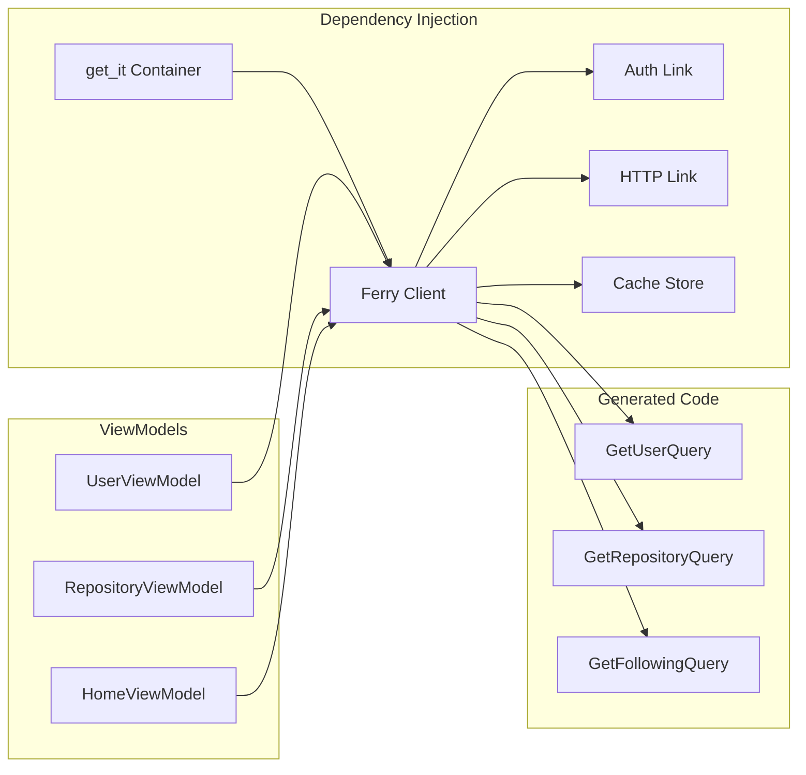
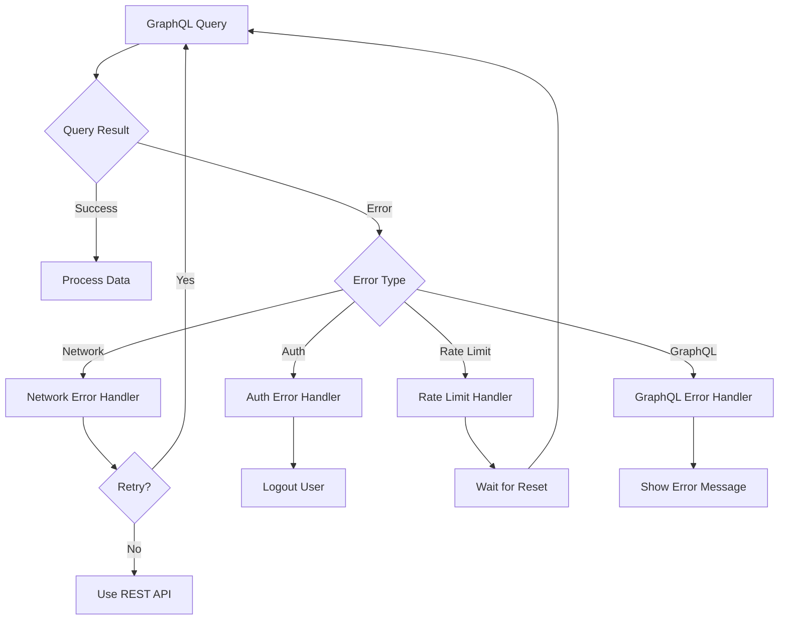

# Design Document - GitHub GraphQL with Ferry

## Overview

This design document outlines the integration of Ferry and ferry_builder into the gh3 Flutter application to connect with GitHub's GraphQL API. Ferry provides a type-safe, code-generated GraphQL client with built-in caching, reactive streams, and excellent developer experience. This integration will complement the existing REST API implementation, allowing for more efficient data fetching and better performance.

The design maintains compatibility with the existing clean architecture while introducing GraphQL-specific patterns and optimizations.

## Architecture

### High-Level Architecture (UI-Component Colocated GraphQL)

```mermaid
graph TB
    subgraph "Screen Components with Colocated ViewModels & GraphQL"
        subgraph "Home Screen"
            HOME_SCREEN[home_screen.dart]
            HOME_VM[home_viewmodel.dart]
            HOME_GQL[home_viewmodel.graphql]
            HOME_CODEGEN[home_viewmodel.graphql.dart]
        end
        
        subgraph "User Details Screen"
            USER_SCREEN[user_details_screen.dart]
            USER_VM[user_details_viewmodel.dart]
            USER_GQL[user_details_viewmodel.graphql]
            USER_CODEGEN[user_details_viewmodel.graphql.dart]
        end
        
        subgraph "Repository Details Screen"
            REPO_SCREEN[repository_details_screen.dart]
            REPO_VM[repository_details_viewmodel.dart]
            REPO_GQL[repository_details_viewmodel.graphql]
            REPO_CODEGEN[repository_details_viewmodel.graphql.dart]
        end
    end
    
    subgraph "UI Components with Colocated Fragments"
        USER_CARD[user_card.dart]
        USER_FRAGMENT[user_card.graphql]
        USER_FRAG_CODE[user_card.graphql.dart]
        
        REPO_CARD[repository_card.dart]
        REPO_FRAGMENT[repository_card.graphql]
        REPO_FRAG_CODE[repository_card.graphql.dart]
    end
    
    subgraph "Ferry Client & Cache"
        FERRY[Ferry Client] --> CACHE[Ferry Cache]
        FERRY --> GITHUB_GQL[GitHub GraphQL API]
    end
    
    HOME_SCREEN --> HOME_VM
    USER_SCREEN --> USER_VM
    REPO_SCREEN --> REPO_VM
    
    HOME_VM --> FERRY
    USER_VM --> FERRY
    REPO_VM --> FERRY
    
    HOME_GQL --> HOME_CODEGEN
    USER_GQL --> USER_CODEGEN
    REPO_GQL --> REPO_CODEGEN
    USER_FRAGMENT --> USER_FRAG_CODE
    REPO_FRAGMENT --> REPO_FRAG_CODE
    
    HOME_SCREEN -.-> USER_CARD
    USER_SCREEN -.-> REPO_CARD
```



### Ferry Integration Architecture



## File Structure and Colocation

### Screen-Level Colocation
```
lib/src/screens/
├── home_screen/
│   ├── home_screen.dart              # Screen widget
│   ├── home_viewmodel.dart           # ViewModel colocated with screen
│   ├── home_viewmodel.graphql        # GraphQL queries for this ViewModel
│   └── home_viewmodel.graphql.dart   # Generated Ferry code
├── user_details_screen/
│   ├── user_details_screen.dart
│   ├── user_details_viewmodel.dart
│   ├── user_details_viewmodel.graphql
│   └── user_details_viewmodel.graphql.dart
└── repository_details_screen/
    ├── repository_details_screen.dart
    ├── repository_details_viewmodel.dart
    ├── repository_details_viewmodel.graphql
    └── repository_details_viewmodel.graphql.dart
```

### UI Component-Level Colocation
```
lib/src/widgets/
├── user_card/
│   ├── user_card.dart                # UI component
│   ├── user_card.graphql             # GraphQL fragment for this component
│   └── user_card.graphql.dart        # Generated fragment types
├── user_profile/
│   ├── user_profile.dart
│   ├── user_profile.graphql
│   └── user_profile.graphql.dart
├── repository_card/
│   ├── repository_card.dart
│   ├── repository_card.graphql
│   └── repository_card.graphql.dart
└── repository_details/
    ├── repository_details.dart
    ├── repository_details.graphql
    └── repository_details.graphql.dart
```

### Benefits of This Structure
- **Perfect locality**: Everything related to a component is in one folder
- **No model classes**: UI components consume GraphQL types directly
- **Fragment reuse**: Components define exactly what data they need
- **Easy maintenance**: Changes to UI requirements update colocated GraphQL
- **Clear dependencies**: Fragments show exactly what data each component uses

## Components and Interfaces

### Ferry Client Configuration

#### FerryClientService
- **Purpose**: Configure and provide Ferry GraphQL client
- **Responsibilities**:
  - Initialize Ferry client with GitHub GraphQL endpoint
  - Configure authentication link with token injection
  - Set up caching policies and storage
  - Handle client lifecycle and token updates
- **Dependencies**: ITokenStorage, http.Client
- **Key Methods**:
  - `createClient()`: Initialize Ferry client with links and cache
  - `updateAuthToken(String token)`: Update authentication headers
  - `clearCache()`: Clear GraphQL cache on logout

#### Authentication Link
- **Purpose**: Inject authentication headers into GraphQL requests
- **Responsibilities**:
  - Add Bearer token to all GraphQL requests
  - Handle token refresh scenarios
  - Provide error handling for authentication failures
- **Integration**: Custom Ferry Link implementation

#### Cache Configuration
- **Purpose**: Configure Ferry's caching behavior
- **Responsibilities**:
  - Set cache policies for different operation types
  - Configure cache persistence options
  - Handle cache invalidation strategies
- **Options**:
  - In-memory cache for development
  - Persistent cache for production
  - Custom cache keys for user-specific data

### GraphQL Operations

#### Schema and Code Generation (UI-Component Colocated)
```yaml
# ferry_builder configuration
targets:
  $default:
    builders:
      ferry_generator:
        options:
          schema: lib/graphql_schema.graphql
          queries_glob: lib/**/*.graphql
          # Generated files colocated with screens, viewmodels, and UI components
          # lib/src/screens/home_screen/home_viewmodel.graphql → home_viewmodel.graphql.dart
          # lib/src/widgets/user_card/user_card.graphql → user_card.graphql.dart
```

#### UI-Component Colocated GraphQL Operations

**Screen-Level Queries (Colocated with ViewModels)**
```graphql
# lib/src/screens/home_screen/home_viewmodel.graphql
query GetFollowing($first: Int!, $after: String) {
  viewer {
    following(first: $first, after: $after) {
      nodes {
        ...UserCardFragment
      }
      pageInfo {
        hasNextPage
        endCursor
      }
    }
  }
}
```

```graphql
# lib/src/screens/user_details_screen/user_details_viewmodel.graphql
query GetUserDetails($login: String!) {
  user(login: $login) {
    ...UserProfileFragment
  }
}

query GetUserRepositories($login: String!, $first: Int!, $after: String) {
  user(login: $login) {
    repositories(first: $first, after: $after, orderBy: {field: UPDATED_AT, direction: DESC}) {
      nodes {
        ...RepositoryCardFragment
      }
      pageInfo {
        hasNextPage
        endCursor
      }
    }
  }
}
```

```graphql
# lib/src/screens/repository_details_screen/repository_details_viewmodel.graphql
query GetRepositoryDetails($owner: String!, $name: String!) {
  repository(owner: $owner, name: $name) {
    ...RepositoryDetailsFragment
    readme: object(expression: "HEAD:README.md") {
      ... on Blob {
        text
      }
    }
  }
}
```

**UI Component Fragments (Colocated with Widgets)**
```graphql
# lib/src/widgets/user_card/user_card.graphql
fragment UserCardFragment on User {
  id
  login
  name
  avatarUrl
  bio
  repositories {
    totalCount
  }
  followers {
    totalCount
  }
}
```

```graphql
# lib/src/widgets/user_profile/user_profile.graphql
fragment UserProfileFragment on User {
  id
  login
  name
  email
  bio
  location
  company
  websiteUrl
  avatarUrl
  url
  repositories {
    totalCount
  }
  followers {
    totalCount
  }
  following {
    totalCount
  }
  createdAt
  updatedAt
}
```

```graphql
# lib/src/widgets/repository_card/repository_card.graphql
fragment RepositoryCardFragment on Repository {
  id
  name
  nameWithOwner
  description
  stargazerCount
  forkCount
  primaryLanguage {
    name
    color
  }
  updatedAt
}
```

```graphql
# lib/src/widgets/repository_details/repository_details.graphql
fragment RepositoryDetailsFragment on Repository {
  id
  name
  nameWithOwner
  description
  url
  homepageUrl
  isPrivate
  isFork
  isArchived
  stargazerCount
  forkCount
  watchers {
    totalCount
  }
  issues(states: OPEN) {
    totalCount
  }
  primaryLanguage {
    name
    color
  }
  createdAt
  updatedAt
  pushedAt
  owner {
    login
    avatarUrl
  }
  languages(first: 10, orderBy: {field: SIZE, direction: DESC}) {
    nodes {
      name
      color
    }
    totalSize
  }
}
```

### UI-Component Colocated GraphQL Integration

This architecture provides maximum colocation by organizing code around UI components:

- **Screen-level colocation**: ViewModels colocated with their screens
- **Component-level colocation**: GraphQL fragments colocated with UI widgets
- **Direct data consumption**: UI components consume GraphQL generated types directly
- **No data models**: Eliminates the need for separate model classes
- **Fragment reuse**: UI components define their own data requirements via fragments

### ViewModel Integration (Colocated Approach)

#### ViewModels with UI-Component Colocated GraphQL
```dart
// lib/src/screens/user_details_screen/user_details_viewmodel.dart
import 'package:ferry/ferry.dart';
import 'user_details_viewmodel.graphql.dart'; // Generated from colocated .graphql

class UserDetailsViewModel extends ChangeNotifier {
  final Client _ferryClient;
  
  // Store raw GraphQL results - no model conversion
  QueryResult<GetUserDetailsQuery>? _userResult;
  QueryResult<GetUserRepositoriesQuery>? _repositoriesResult;
  
  StreamSubscription<QueryResult<GetUserDetailsQuery>>? _userSubscription;
  StreamSubscription<QueryResult<GetUserRepositoriesQuery>>? _reposSubscription;
  
  UserDetailsViewModel(this._ferryClient);
  
  // Expose raw GraphQL data for UI consumption
  GetUserDetailsQuery$Query$User? get user => _userResult?.data?.user;
  GetUserRepositoriesQuery$Query$User$Repositories? get repositories => 
      _repositoriesResult?.data?.user?.repositories;
  
  bool get isLoading => 
      (_userResult?.loading ?? true) || (_repositoriesResult?.loading ?? true);
  
  String? get error {
    if (_userResult?.hasException == true) {
      return _userResult!.exception.toString();
    }
    if (_repositoriesResult?.hasException == true) {
      return _repositoriesResult!.exception.toString();
    }
    return null;
  }
  
  Future<void> loadUser(String login) async {
    // Load user profile
    final userRequest = GetUserDetailsQuery(
      variables: GetUserDetailsArguments(login: login),
    );
    
    _userSubscription = _ferryClient
        .request(userRequest)
        .listen((result) {
          _userResult = result;
          notifyListeners();
        });
        
    // Load user repositories
    final reposRequest = GetUserRepositoriesQuery(
      variables: GetUserRepositoriesArguments(
        login: login,
        first: 20,
        after: null,
      ),
    );
    
    _reposSubscription = _ferryClient
        .request(reposRequest)
        .listen((result) {
          _repositoriesResult = result;
          notifyListeners();
        });
  }
  
  @override
  void dispose() {
    _userSubscription?.cancel();
    _reposSubscription?.cancel();
    super.dispose();
  }
}
```

#### Screen with Colocated ViewModel and UI Components
```dart
// lib/src/screens/user_details_screen/user_details_screen.dart
import 'package:flutter/material.dart';
import 'package:get_it/get_it.dart';
import 'package:ferry/ferry.dart';
import 'user_details_viewmodel.dart';
import '../../widgets/user_profile/user_profile.dart';
import '../../widgets/repository_card/repository_card.dart';

class UserDetailsScreen extends StatefulWidget {
  final String username;
  
  const UserDetailsScreen({Key? key, required this.username}) : super(key: key);
  
  @override
  State<UserDetailsScreen> createState() => _UserDetailsScreenState();
}

class _UserDetailsScreenState extends State<UserDetailsScreen> {
  late UserDetailsViewModel _viewModel;
  
  @override
  void initState() {
    super.initState();
    _viewModel = UserDetailsViewModel(GetIt.instance<Client>());
    _viewModel.addListener(_onViewModelChanged);
    _viewModel.loadUser(widget.username);
  }
  
  @override
  Widget build(BuildContext context) {
    return Scaffold(
      appBar: AppBar(title: Text(widget.username)),
      body: _buildBody(),
    );
  }
  
  Widget _buildBody() {
    if (_viewModel.isLoading) {
      return const Center(child: CircularProgressIndicator());
    }
    
    if (_viewModel.error != null) {
      return Center(child: Text('Error: ${_viewModel.error}'));
    }
    
    return SingleChildScrollView(
      padding: const EdgeInsets.all(16),
      child: Column(
        crossAxisAlignment: CrossAxisAlignment.start,
        children: [
          // UserProfile widget consumes GraphQL fragment data directly
          if (_viewModel.user != null)
            UserProfile(user: _viewModel.user!),
          
          const SizedBox(height: 24),
          
          // Repository list using RepositoryCard widgets
          if (_viewModel.repositories?.nodes != null)
            ...(_viewModel.repositories!.nodes!.map((repo) => 
              Padding(
                padding: const EdgeInsets.only(bottom: 8),
                child: RepositoryCard(repository: repo),
              )
            )),
        ],
      ),
    );
  }
  
  void _onViewModelChanged() {
    if (mounted) setState(() {});
  }
  
  @override
  void dispose() {
    _viewModel.removeListener(_onViewModelChanged);
    _viewModel.dispose();
    super.dispose();
  }
}
```

#### UI Components Consuming GraphQL Fragments Directly
```dart
// lib/src/widgets/user_profile/user_profile.dart
import 'package:flutter/material.dart';
import 'user_profile.graphql.dart'; // Generated fragment types

class UserProfile extends StatelessWidget {
  final UserProfileFragment user; // Direct GraphQL fragment consumption
  
  const UserProfile({Key? key, required this.user}) : super(key: key);
  
  @override
  Widget build(BuildContext context) {
    return Card(
      child: Padding(
        padding: const EdgeInsets.all(16),
        child: Column(
          crossAxisAlignment: CrossAxisAlignment.start,
          children: [
            Row(
              children: [
                CircleAvatar(
                  backgroundImage: NetworkImage(user.avatarUrl),
                  radius: 30,
                ),
                const SizedBox(width: 16),
                Expanded(
                  child: Column(
                    crossAxisAlignment: CrossAxisAlignment.start,
                    children: [
                      Text(
                        user.name ?? user.login,
                        style: Theme.of(context).textTheme.headlineSmall,
                      ),
                      Text('@${user.login}'),
                      if (user.location != null)
                        Text(user.location!),
                    ],
                  ),
                ),
              ],
            ),
            if (user.bio != null) ...[
              const SizedBox(height: 16),
              Text(user.bio!),
            ],
            const SizedBox(height: 16),
            Row(
              children: [
                _buildStat('Repositories', user.repositories.totalCount),
                const SizedBox(width: 24),
                _buildStat('Followers', user.followers.totalCount),
                const SizedBox(width: 24),
                _buildStat('Following', user.following.totalCount),
              ],
            ),
          ],
        ),
      ),
    );
  }
  
  Widget _buildStat(String label, int count) {
    return Column(
      children: [
        Text(
          count.toString(),
          style: const TextStyle(fontWeight: FontWeight.bold, fontSize: 18),
        ),
        Text(label, style: const TextStyle(fontSize: 12)),
      ],
    );
  }
}
```

```dart
// lib/src/widgets/repository_card/repository_card.dart
import 'package:flutter/material.dart';
import 'repository_card.graphql.dart'; // Generated fragment types

class RepositoryCard extends StatelessWidget {
  final RepositoryCardFragment repository; // Direct GraphQL fragment consumption
  
  const RepositoryCard({Key? key, required this.repository}) : super(key: key);
  
  @override
  Widget build(BuildContext context) {
    return Card(
      child: ListTile(
        title: Text(repository.name),
        subtitle: Column(
          crossAxisAlignment: CrossAxisAlignment.start,
          children: [
            if (repository.description != null)
              Text(repository.description!),
            const SizedBox(height: 4),
            Row(
              children: [
                if (repository.primaryLanguage != null) ...[
                  Container(
                    width: 12,
                    height: 12,
                    decoration: BoxDecoration(
                      color: Color(int.parse(
                        repository.primaryLanguage!.color?.replaceFirst('#', '0xFF') ?? '0xFF000000'
                      )),
                      shape: BoxShape.circle,
                    ),
                  ),
                  const SizedBox(width: 4),
                  Text(repository.primaryLanguage!.name),
                  const SizedBox(width: 16),
                ],
                Icon(Icons.star, size: 16),
                Text(' ${repository.stargazerCount}'),
                const SizedBox(width: 16),
                Icon(Icons.call_split, size: 16),
                Text(' ${repository.forkCount}'),
              ],
            ),
          ],
        ),
      ),
    );
  }
}
```

### Error Handling Strategy

#### GraphQL Error Types
```dart
abstract class GraphQLError {
  final String message;
  final String? code;
  
  const GraphQLError(this.message, {this.code});
}

class GraphQLNetworkError extends GraphQLError {
  final int? statusCode;
  
  const GraphQLNetworkError(String message, {this.statusCode}) 
      : super(message, code: 'NETWORK_ERROR');
}

class GraphQLAuthenticationError extends GraphQLError {
  const GraphQLAuthenticationError(String message) 
      : super(message, code: 'AUTHENTICATION_ERROR');
}

class GraphQLRateLimitError extends GraphQLError {
  final DateTime? resetTime;
  
  const GraphQLRateLimitError(String message, {this.resetTime}) 
      : super(message, code: 'RATE_LIMIT_ERROR');
}
```

#### Error Handling Flow


## Caching Strategy

### Cache Policies

#### Query-Specific Policies
- **User Profiles**: Cache for 5 minutes, background refresh
- **Repository Data**: Cache for 2 minutes, aggressive refresh
- **Following Lists**: Cache for 10 minutes, manual refresh
- **Search Results**: Cache for 1 minute, no background refresh

#### Cache Invalidation
```dart
class CacheInvalidationService {
  final Client _ferryClient;
  
  // Invalidate user-related caches when user data changes
  void invalidateUserCache(String login) {
    _ferryClient.cache.evict(
      typename: 'User',
      id: login,
    );
  }
  
  // Invalidate repository caches when repository changes
  void invalidateRepositoryCache(String owner, String name) {
    _ferryClient.cache.evict(
      typename: 'Repository', 
      id: '$owner/$name',
    );
  }
}
```

### Offline Support

#### Cache Persistence
- Use Ferry's built-in cache persistence
- Store critical data for offline access
- Implement cache warming strategies
- Handle cache size limits gracefully

#### Offline-First Queries
```dart
// Configure queries for offline-first behavior
final userQuery = GetUserQuery(
  variables: GetUserArguments(login: login),
  fetchPolicy: FetchPolicy.cacheFirst,
  errorPolicy: ErrorPolicy.all, // Return partial data with errors
);
```

## Performance Optimizations

### Query Optimization

#### Field Selection
- Request only necessary fields in GraphQL queries
- Use fragments to avoid duplication
- Implement field-level caching where appropriate

#### Pagination Strategy
```graphql
query GetRepositoriesPaginated($login: String!, $first: Int!, $after: String) {
  user(login: $login) {
    repositories(first: $first, after: $after, orderBy: {field: UPDATED_AT, direction: DESC}) {
      nodes {
        ...RepositoryFragment
      }
      pageInfo {
        hasNextPage
        hasPreviousPage
        startCursor
        endCursor
      }
    }
  }
}
```

#### Batch Operations
- Combine related queries when possible
- Use GraphQL aliases for multiple similar queries
- Implement query batching for related data

### Memory Management

#### Stream Management
```dart
class GraphQLViewModel extends ChangeNotifier {
  final List<StreamSubscription> _subscriptions = [];
  
  @override
  void dispose() {
    // Cancel all GraphQL subscriptions
    for (final subscription in _subscriptions) {
      subscription.cancel();
    }
    _subscriptions.clear();
    super.dispose();
  }
  
  void _addSubscription(StreamSubscription subscription) {
    _subscriptions.add(subscription);
  }
}
```

## Testing Strategy

### Unit Testing GraphQL Operations

#### Mock Ferry Client
```dart
class MockFerryClient extends Mock implements Client {}

void main() {
  group('GraphQLUserService', () {
    late MockFerryClient mockClient;
    late GraphQLUserService service;
    
    setUp(() {
      mockClient = MockFerryClient();
      service = GraphQLUserService(mockClient);
    });
    
    test('should fetch user successfully', () async {
      // Arrange
      final mockResult = QueryResult(
        data: GetUserQuery$Query.fromJson(mockUserData),
        loading: false,
      );
      
      when(mockClient.request(any)).thenAnswer(
        (_) => Stream.value(mockResult),
      );
      
      // Act
      final result = await service.getUser('testuser').first;
      
      // Assert
      expect(result.data?.user?.login, equals('testuser'));
      verify(mockClient.request(any)).called(1);
    });
  });
}
```

### Integration Testing

#### GraphQL Schema Testing
- Validate generated code against schema changes
- Test query execution against real GitHub API
- Verify fragment composition and reuse

#### Cache Testing
- Test cache hit/miss scenarios
- Verify cache invalidation logic
- Test offline behavior with cached data

## Migration Strategy

### Gradual Migration Approach

#### Phase 1: Infrastructure Setup
1. Add Ferry dependencies and configuration
2. Set up code generation pipeline
3. Create basic GraphQL operations
4. Implement authentication integration

#### Phase 2: Parallel Implementation
1. Implement GraphQL services alongside REST
2. Update ViewModels to use GraphQL where beneficial
3. Maintain REST API as fallback
4. Add comprehensive testing

#### Phase 3: Optimization and Cleanup
1. Optimize GraphQL queries and caching
2. Remove redundant REST API calls
3. Implement advanced Ferry features
4. Performance tuning and monitoring

### Coexistence Strategy
- GraphQL for complex, nested data fetching
- REST API for simple operations and fallbacks
- Shared authentication and error handling
- Consistent data models across both approaches

## Security Considerations

### Authentication Integration
- Reuse existing token storage and management
- Implement token refresh in GraphQL context
- Handle authentication errors consistently

### Query Security
- Validate query complexity and depth
- Implement query whitelisting if needed
- Monitor for potential GraphQL-specific attacks

### Data Privacy
- Respect GitHub's API rate limits and terms
- Implement proper data retention policies
- Handle sensitive data appropriately in caches