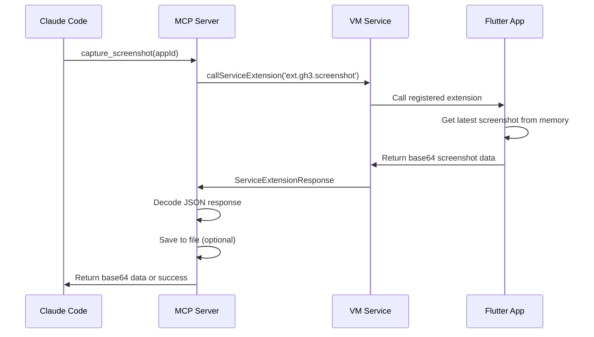

# Screenshot System Technical Documentation

## Overview

This document describes the technical implementation of a programmatic screenshot capture system for Flutter applications running on physical iOS devices, bypassing the limitations of Flutter's built-in inspector screenshot capabilities.

## Architecture

```
┌─────────────────┐    ┌──────────────────┐    ┌─────────────────┐
│   Claude Code   │◄──►│   MCP Server     │◄──►│  Flutter App    │
│                 │    │                  │    │   (iPhone)      │
└─────────────────┘    └──────────────────┘    └─────────────────┘
        │                        │                        │
        │              VM Service WebSocket                │
        │              ws://127.0.0.1:8181/ws             │
        └─────────────────────────────────────────────────┘
```

## Components

### 1. Flutter App Side (iPhone)

#### ScreenshotWrapper Widget
**Location**: `lib/src/widgets/screenshot_wrapper.dart`

```dart
class ScreenshotWrapper extends StatefulWidget {
  final Widget child;
  const ScreenshotWrapper({Key? key, required this.child}) : super(key: key);
}

class _ScreenshotWrapperState extends State<ScreenshotWrapper> {
  final GlobalKey _repaintBoundaryKey = GlobalKey();
  String? _latestScreenshot;
  DateTime? _screenshotTimestamp;
```

**Key Features:**
- Wraps the entire Flutter app with `RepaintBoundary`
- Captures screenshots every 5 seconds using `Timer.periodic`
- Stores screenshots in memory as base64-encoded strings
- Registers VM service extensions for external access

#### Screenshot Capture Process

1. **RenderRepaintBoundary Setup**: The widget uses a `RepaintBoundary` with a `GlobalKey` to capture the visual tree
2. **Periodic Capture**: Timer triggers `_captureAndStoreScreenshot()` every 5 seconds
3. **Image Conversion**: 
   ```dart
   final boundary = _repaintBoundaryKey.currentContext!.findRenderObject() as RenderRepaintBoundary;
   final image = await boundary.toImage(pixelRatio: 3.0);
   final byteData = await image.toByteData(format: ImageByteFormat.png);
   ```
4. **Base64 Encoding**: PNG bytes are converted to base64 for transmission
5. **Memory Storage**: Latest screenshot stored in `_latestScreenshot` variable

#### VM Service Extensions

Two service extensions are registered:

1. **Test Extension** (`ext.gh3.test`):
   ```dart
   developer.registerExtension('ext.gh3.test', (method, parameters) async {
     return developer.ServiceExtensionResponse.result(json.encode({
       'test': 'working',
       'hasScreenshot': _latestScreenshot != null,
     }));
   });
   ```

2. **Screenshot Extension** (`ext.gh3.screenshot`):
   ```dart
   developer.registerExtension('ext.gh3.screenshot', (method, parameters) async {
     if (_latestScreenshot != null) {
       return developer.ServiceExtensionResponse.result(json.encode({
         'success': true,
         'screenshot': _latestScreenshot,
         'timestamp': _screenshotTimestamp?.toIso8601String(),
       }));
     }
     // ... error handling
   });
   ```

### 2. MCP Server Side

#### FlutterController Class
**Location**: `mcp_flutter_automation/lib/src/flutter_controller.dart`

**Key Methods:**

1. **App Management**:
   ```dart
   Future<FlutterApp> launchApp({
     required String appId,
     required String projectPath,
     String? targetFile,
     String? deviceId,
     int vmServicePort = 8182,
     int ddsPort = 8181,
   })
   ```

2. **Screenshot Capture**:
   ```dart
   Future<String?> captureScreenshot(String appId)
   ```

#### Screenshot Capture Flow

1. **VM Service Connection**: 
   - MCP server maintains WebSocket connection to `ws://127.0.0.1:8181/ws`
   - Connection established when Flutter app launches with `--vm-service-port=8182`

2. **Service Extension Call**:
   ```dart
   final response = await app.vmService!.callServiceExtension(
     'ext.gh3.screenshot',
     isolateId: app.isolateId,
   );
   ```

3. **Response Processing**:
   ```dart
   if (response.json != null && response.json!.containsKey('result')) {
     final result = response.json!['result'];
     if (result is String) {
       final responseData = json.decode(result);
       if (responseData['success'] == true && responseData['screenshot'] != null) {
         final base64Data = responseData['screenshot'] as String;
         // Process screenshot data
       }
     }
   }
   ```

4. **File Saving** (Enhanced Feature):
   ```dart
   final bytes = base64Decode(base64Data);
   final timestamp = DateTime.now().millisecondsSinceEpoch;
   final fileName = 'screenshot_${timestamp}.png';
   final filePath = '${app.projectPath}/$fileName';
   final file = File(filePath);
   await file.writeAsBytes(bytes);
   ```

### 3. Claude Code Integration

Claude Code communicates with the MCP server through MCP protocol calls:

```javascript
mcp__flutter-automation__capture_screenshot(appId: "gh3_final")
```

## Communication Protocol

### 1. VM Service Protocol

The communication uses Dart VM Service Protocol over WebSocket:

```json
{
  "jsonrpc": "2.0",
  "method": "callServiceExtension",
  "params": {
    "method": "ext.gh3.screenshot",
    "isolateId": "isolates/5086545250557151"
  },
  "id": "2"
}
```

**Response:**
```json
{
  "jsonrpc": "2.0",
  "result": {
    "type": "ServiceExtensionResponse",
    "method": "ext.gh3.screenshot",
    "result": "{\"success\":true,\"screenshot\":\"iVBORw0KGgoAAAANSUhEUgAAA1w...\",\"timestamp\":\"2025-08-01T23:35:29.585726\"}"
  },
  "id": "2"
}
```

### 2. MCP Protocol

Claude Code ↔ MCP Server communication uses Model Context Protocol:

```json
{
  "method": "tools/call",
  "params": {
    "name": "mcp__flutter-automation__capture_screenshot",
    "arguments": {
      "appId": "gh3_final"
    }
  }
}
```

## Data Flow



## Technical Challenges & Solutions

### 1. iOS Physical Device Limitations

**Problem**: Flutter Inspector screenshots don't work on physical iOS devices
**Solution**: Custom `RenderRepaintBoundary.toImage()` implementation

### 2. Network/Firewall Issues

**Problem**: HTTP server approach blocked by firewall
**Solution**: Use existing VM Service WebSocket connection

### 3. Service Extension Registration

**Problem**: Extensions not registering properly
**Solution**: Register immediately in `initState()`, removed frame callback delays

### 4. Data Transmission

**Problem**: Large screenshot data (47KB → 63KB base64)
**Solution**: Store in memory, transmit on-demand via service extensions

### 5. MCP Server State Management

**Problem**: MCP server losing app state on restart
**Solution**: Maintain running app registry in `FlutterController`

## Performance Metrics

- **Screenshot Size**: ~47KB PNG (1179x2556 resolution)
- **Base64 Size**: ~63KB encoded data
- **Capture Frequency**: Every 5 seconds
- **Capture Time**: ~100-200ms per screenshot
- **Memory Usage**: ~63KB per screenshot in memory
- **Network Latency**: <50ms for VM Service calls

## Configuration

### Flutter App Launch Parameters
```bash
flutter run --vm-service-port=8182 --dds-port=8181 -d 00008120-001471901EE0201E
```

### MCP Server Configuration
```dart
final app = FlutterApp(
  id: appId,
  projectPath: projectPath,
  deviceId: deviceId,
  vmServicePort: vmServicePort,
  ddsPort: ddsPort,
);
```

## Error Handling

### Common Issues

1. **VM Service Not Connected**: Check `hasVmService` flag
2. **Extension Not Registered**: Verify app initialization completed
3. **Screenshot Capture Failed**: Check `RenderRepaintBoundary` key validity
4. **Base64 Decode Error**: Validate data integrity
5. **File Save Error**: Check write permissions and disk space

### Debugging

Enable detailed logging:
```dart
Logger.root.level = Level.ALL;
Logger.root.onRecord.listen((record) {
  print('${record.level.name}: ${record.time}: ${record.message}');
});
```

## Improvements & Future Enhancements

### Current Limitations

1. **MCP Server Restart Required**: Code changes require full MCP server restart
2. **Manual File Reading**: Files must be read separately after capture
3. **Fixed Capture Interval**: 5-second timer is hardcoded
4. **Memory Storage Only**: Screenshots not persisted in app
5. **Single App Support**: MCP server optimized for one app at a time

### Proposed Improvements

1. **Hot Code Reload**: Support dynamic MCP server code updates
2. **Integrated File System**: MCP server should auto-read and return image content
3. **Configurable Capture**: Allow custom intervals and trigger modes
4. **Persistent Storage**: Add app-side screenshot history
5. **Multi-App Support**: Handle multiple Flutter apps simultaneously
6. **Image Optimization**: Compress screenshots for faster transmission
7. **Real-time Streaming**: WebSocket-based live screenshot streaming
8. **OCR Integration**: Automatic text extraction from screenshots
9. **Screenshot Comparison**: Diff detection for UI changes
10. **Annotation Support**: Allow markup and analysis of screenshots

### Implementation Priority

**High Priority:**
- Auto-read captured files in MCP server
- Configurable capture intervals
- Better error handling and recovery

**Medium Priority:**
- Multi-app support
- Image compression
- Persistent storage

**Low Priority:**
- Real-time streaming
- OCR integration
- Advanced analysis features

## Security Considerations

1. **VM Service Access**: Limited to localhost connections
2. **File System Access**: Screenshots saved to project directory only
3. **Data Transmission**: Base64 encoding provides basic obfuscation
4. **Device Permissions**: Requires iOS development profile
5. **Network Security**: WebSocket connections not encrypted (localhost only)

## Conclusion

This screenshot system successfully demonstrates how to capture programmatic screenshots from Flutter apps running on physical iOS devices by:

1. Using `RenderRepaintBoundary` for image capture
2. Implementing custom VM Service extensions
3. Leveraging existing debugging infrastructure
4. Providing MCP integration for external tool access

The system is functional but has room for improvement in areas like hot reloading, file management, and multi-app support.