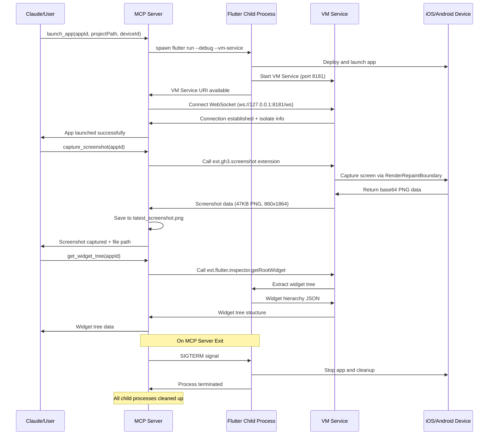

# MCP Flutter Automation Server

A Model Context Protocol (MCP) server for automating Flutter app operations with advanced screenshot capabilities and widget inspection. Features child process management for reliable Flutter app lifecycle control.

## Features

- **🚀 Flutter App Lifecycle**: Launch, hot reload/restart, and stop Flutter apps as managed child processes
- **📸 Advanced Screenshot Capture**: Multi-method screenshot system with custom VM service extensions
- **🔍 Widget Inspector Integration**: Combined screenshot and widget tree analysis with coordinate mapping
- **📱 Device Management**: Support for physical devices (iOS/Android) and simulators
- **🛡️ Process Safety**: Automatic child process cleanup prevents orphaned Flutter processes
- **📊 Real-time Monitoring**: Live log streaming and app state tracking
- **🔧 Multi-app Support**: Manage multiple Flutter apps in a single session

## Setup

### Prerequisites

- **Flutter SDK**: Version 3.0+ installed and configured
- **Dart SDK**: Version 3.0+ (bundled with Flutter)
- **Physical Device**: iOS/Android device connected via USB or wireless debugging
- **Xcode** (for iOS development) or **Android Studio** (for Android development)

### Installation

1. **Install Dependencies**
   ```bash
   cd mcp_flutter_automation
   flutter pub get
   flutter packages pub run build_runner build --delete-conflicting-outputs
   ```

2. **Verify Installation**
   ```bash
   dart run bin/mcp_flutter_automation.dart --help
   ```

### Configuration

#### Claude Desktop Integration

Add to your Claude Desktop config (`~/Library/Application Support/Claude/claude_desktop_config.json`):

```json
{
  "mcpServers": {
    "flutter-automation": {
      "command": "dart",
      "args": ["run", "bin/mcp_flutter_automation.dart"],
      "cwd": "/path/to/your/project/mcp_flutter_automation",
      "env": {}
    }
  }
}
```

#### Project Configuration

Ensure your Flutter project has the screenshot extension enabled in `lib/main.dart`:

```dart
import 'package:flutter/foundation.dart';
import 'package:flutter/services.dart';

void main() {
  // Enable Flutter Driver for VM service extensions
  if (kDebugMode) {
    enableFlutterDriverExtension();
  }
  
  runApp(MyApp());
}
```

## How It Works

### Architecture Overview

The MCP Flutter Automation Server uses a **child process architecture** where:

1. **MCP Server Process**: Manages the JSON-RPC protocol and tool requests
2. **Flutter Child Processes**: Each launched Flutter app runs as a child process
3. **VM Service Connection**: WebSocket connection to Flutter's debugging interface
4. **Screenshot Extensions**: Custom VM service extensions for advanced screenshot capture

### Key Components

- **FlutterController**: Manages Flutter app lifecycle and VM service connections
- **WidgetInspector**: Combines screenshots with widget tree analysis
- **Process Manager**: Handles child process creation and automatic cleanup
- **Screenshot System**: Multi-layered fallback system for reliable image capture

### Screenshot Capture Methods

The system employs a **3-tier fallback approach**:

1. **Primary**: Custom `ext.gh3.screenshot` extension (RenderRepaintBoundary-based)
2. **Fallback 1**: Flutter Driver's `ext.flutter.driver.screenshot` extension
3. **Fallback 2**: Direct VM service connection with fresh WebSocket

## Key Flow Sequence



## Available Tools

### Core App Management

1. **`launch_app`** - Launch Flutter app as child process
   ```json
   {
     "appId": "string",           // Unique app identifier
     "projectPath": "string",     // Path to Flutter project root
     "deviceId": "string?",       // Target device ID (optional)
     "targetFile": "string?",     // Entry point file (default: lib/main.dart)
     "vmServicePort": "number?",  // VM service port (default: 8182)
     "ddsPort": "number?"         // DDS port (default: 8181)
   }
   ```

2. **`stop_app`** - Terminate Flutter app and cleanup
   ```json
   {
     "appId": "string"
   }
   ```

3. **`hot_reload`** - Trigger hot reload
   ```json
   {
     "appId": "string"
   }
   ```

4. **`hot_restart`** - Trigger hot restart
   ```json
   {
     "appId": "string"
   }
   ```

### Screenshot & Inspection

5. **`capture_screenshot`** - Advanced screenshot capture
   ```json
   {
     "appId": "string",
     "filename": "string?"        // Optional filename (default: latest_screenshot.png)
   }
   ```

6. **`inspect_widget_tree`** - Combined screenshot + widget analysis
   ```json
   {
     "appId": "string",
     "includeWidgetBounds": "boolean?",    // Include widget coordinates
     "includeWidgetTree": "boolean?",      // Include widget hierarchy
     "filename": "string?"                 // Screenshot filename
   }
   ```

7. **`get_widgets_at_position`** - Find widgets at screen coordinates
   ```json
   {
     "appId": "string",
     "x": "number",              // Screen X coordinate
     "y": "number"               // Screen Y coordinate
   }
   ```

8. **`create_annotated_screenshot`** - Screenshot with widget overlays
   ```json
   {
     "appId": "string",
     "annotations": ["array"],    // Widget IDs to highlight
     "filename": "string?"
   }
   ```

### Information & Monitoring

9. **`get_widget_tree`** - Get Flutter widget hierarchy
   ```json
   {
     "appId": "string"
   }
   ```

10. **`get_logs`** - Retrieve app logs
    ```json
    {
      "appId": "string",
      "count": "number?"          // Number of recent lines (default: 100)
    }
    ```

11. **`list_apps`** - List all managed Flutter apps
    ```json
    {}
    ```

12. **`get_app_info`** - Get detailed app information
    ```json
    {
      "appId": "string"
    }
    ```

## Example Usage

### Basic Workflow

```bash
# 1. Launch Flutter app
{"jsonrpc": "2.0", "method": "tools/call", "params": {"name": "launch_app", "arguments": {"appId": "my_app", "projectPath": "/Users/dev/my_flutter_app", "deviceId": "device_id"}}, "id": 1}

# 2. Capture screenshot
{"jsonrpc": "2.0", "method": "tools/call", "params": {"name": "capture_screenshot", "arguments": {"appId": "my_app"}}, "id": 2}

# 3. Inspect widget tree with screenshot
{"jsonrpc": "2.0", "method": "tools/call", "params": {"name": "inspect_widget_tree", "arguments": {"appId": "my_app"}}, "id": 3}

# 4. Stop app
{"jsonrpc": "2.0", "method": "tools/call", "params": {"name": "stop_app", "arguments": {"appId": "my_app"}}, "id": 4}
```

### Advanced Screenshot Analysis

```bash
# Find widgets at specific coordinates
{"jsonrpc": "2.0", "method": "tools/call", "params": {"name": "get_widgets_at_position", "arguments": {"appId": "my_app", "x": 200, "y": 400}}, "id": 5}

# Create annotated screenshot
{"jsonrpc": "2.0", "method": "tools/call", "params": {"name": "create_annotated_screenshot", "arguments": {"appId": "my_app", "annotations": ["widget_123", "widget_456"]}}, "id": 6}
```

## Limitations and Known Issues

### Current Limitations

1. **Flutter Inspector API Requirements**
   - Some widget inspector methods require `objectGroup` parameters
   - Certain Flutter Inspector extensions may fail with parameter validation errors
   - **Workaround**: Use custom screenshot extensions instead of Flutter's built-in inspector screenshot

2. **Device Connection Dependencies**
   - Wireless debugging can be unstable and may timeout during app installation
   - **Recommendation**: Use USB connections for development, wireless for testing only
   - Multiple VM Service reports may appear for wireless connections (uses first one)

3. **Screenshot Resolution Constraints**
   - Screenshot resolution depends on device screen density and Flutter's rendering setup
   - Current implementation captures at device native resolution (e.g., 860x1864 for iPhone 14 Pro Max)
   - **Note**: File sizes typically range from 40-60KB for PNG format

4. **Process Lifecycle Dependencies**
   - Child processes are only cleaned up when MCP server terminates gracefully
   - Force-killed MCP servers may leave orphaned Flutter processes
   - **Mitigation**: Built-in SIGTERM/SIGINT handlers provide cleanup in most scenarios

### Known Issues

1. **VM Service Connection Timing**
   - **Issue**: VM service may take 60-90 seconds to become available on wireless connections
   - **Impact**: Launch operations may timeout during app installation phase
   - **Workaround**: Increase timeout values or use USB connections

2. **Widget Inspector Parameter Validation**
   - **Issue**: Flutter framework validates inspector extension parameters strictly
   - **Error**: `Failed assertion: 'parameters.containsKey('objectGroup')': is not true`
   - **Status**: Framework limitation, not a bug in MCP server
   - **Workaround**: Use `capture_screenshot` instead of widget inspector methods when this occurs

3. **Multiple Dart VM Service Reports**
   - **Issue**: Wireless debugging may report multiple VM services for same device
   - **Error**: `Unexpectedly found more than one Dart VM Service report for [device]`
   - **Impact**: System uses first available service, may cause connection issues
   - **Workaround**: Disable and re-enable wireless debugging to reset service discovery

4. **Child Process Platform Dependencies**
   - **Issue**: Process cleanup behavior varies between macOS, Linux, and Windows
   - **Impact**: Signal handling and process group termination may differ
   - **Status**: Tested primarily on macOS, additional platform testing needed

### Troubleshooting

#### Common Setup Issues

- **Flutter not found**: Ensure Flutter SDK is in PATH and `flutter doctor` passes
- **Device not detected**: Check `flutter devices` shows your target device
- **Permission errors**: Verify Xcode automation permissions for iOS devices
- **Port conflicts**: Ensure ports 8181/8182 are available (default VM service ports)

#### Connection Issues

- **VM Service timeout**: Wait longer for wireless connections or switch to USB
- **WebSocket connection failed**: Verify no firewall blocking ports 8181/8182
- **Extension not available**: Ensure `enableFlutterDriverExtension()` is called in debug mode

#### Process Issues

- **Orphaned processes**: Manually kill with `pkill -f flutter` if MCP server crashes
- **Multiple instances**: Check `ps aux | grep flutter` for existing processes before starting

For additional support, check the logs for detailed error messages and stack traces.