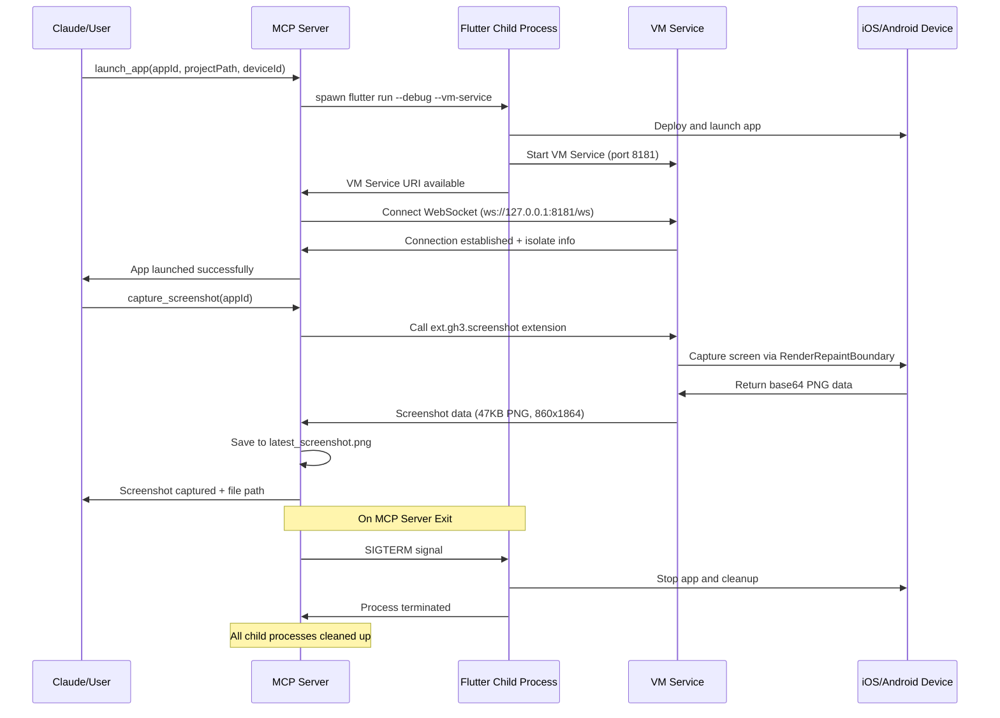

# MCP Flutter Automation Server

A Model Context Protocol (MCP) server for automating Flutter app operations with advanced screenshot capabilities. Features child process management for reliable Flutter app lifecycle control.

## Development Goals

This project serves as a **development platform for MCP Flutter automation capabilities**, with the primary goal of creating a robust toolset for AI code agents to interact with Flutter applications. The server enables:

- **AI-Driven Flutter Testing**: Automated screenshot capture and UI testing
- **Code Agent Integration**: Seamless integration with Claude Code and other AI development tools
- **Flutter Development Automation**: Hot reload/restart, build management, and deployment workflows
- **Visual Analysis**: Screenshot capture for UI testing and visual verification

### Code Agent Proxy Integration

The project includes a **development proxy tool** (`mcp_dev_proxy`) that provides crash recovery and enhanced debugging capabilities for MCP server development:

- **Crash Recovery**: Automatically restarts the MCP server if it crashes during development
- **Enhanced Logging**: Detailed logging of MCP protocol messages and tool calls
- **Development Stability**: Prevents connection drops during long-running operations
- **Tool Call Debugging**: Real-time monitoring of MCP tool invocations and responses

The proxy is configured in `.mcp.json` and acts as an intermediary between Claude Code and the Flutter automation server.

## Features

- **🚀 Flutter App Lifecycle**: Launch, hot reload/restart, and stop Flutter apps as managed child processes
- **📸 Advanced Screenshot Capture**: Multi-method screenshot system with custom VM service extensions
- **📱 Device Management**: Support for physical devices (iOS/Android) and simulators
- **🛡️ Process Safety**: Automatic child process cleanup prevents orphaned Flutter processes
- **📊 Real-time Monitoring**: Live log streaming and app state tracking
- **🔧 Multi-app Support**: Manage multiple Flutter apps in a single session

## Setup

### Prerequisites

- **Flutter SDK**: Version 3.0+ installed and configured
- **Dart SDK**: Version 3.0+ (bundled with Flutter)
- **Physical Device**: iOS/Android device connected via USB or wireless debugging
- **Xcode** (for iOS development) or **Android Studio** (for Android development)

### Installation

1. **Install Dependencies**
   ```bash
   cd mcp_flutter_automation
   flutter pub get
   flutter packages pub run build_runner build --delete-conflicting-outputs
   ```

2. **Verify Installation**
   ```bash
   dart run bin/mcp_flutter_automation.dart --help
   ```

### Configuration

#### Claude Desktop Integration

Add to your Claude Desktop config (`~/Library/Application Support/Claude/claude_desktop_config.json`):

```json
{
  "mcpServers": {
    "flutter-automation": {
      "command": "dart",
      "args": ["run", "bin/mcp_flutter_automation.dart"],
      "cwd": "/path/to/your/project/mcp_flutter_automation",
      "env": {}
    }
  }
}
```

#### Development Proxy Setup (Recommended)

For enhanced development stability and crash recovery, use the MCP development proxy. Update your local `.mcp.json`:

```json
{
  "mcpServers": {
    "flutter-automation": {
      "command": "../mcp_dev_proxy/mcp_dev_proxy_binary",
      "args": ["./mcp_flutter_automation_binary"],
      "env": {
        "LOG_LEVEL": "INFO"
      }
    }
  }
}
```

The proxy provides:
- **Automatic restart** if the MCP server crashes
- **Enhanced logging** for debugging MCP protocol issues
- **Connection stability** during long-running operations
- **Development-focused error handling** and recovery

#### Project Configuration

The system uses custom VM service extensions that are automatically registered in the example Flutter app. No additional setup is required for screenshot functionality.

## How It Works

### Architecture Overview

The MCP Flutter Automation Server uses a **child process architecture** where:

1. **MCP Server Process**: Manages the JSON-RPC protocol and tool requests
2. **Flutter Child Processes**: Each launched Flutter app runs as a child process
3. **VM Service Connection**: WebSocket connection to Flutter's debugging interface
4. **Screenshot Extensions**: Custom VM service extensions for advanced screenshot capture

### Key Components

- **FlutterController**: Manages Flutter app lifecycle and VM service connections
- **Process Manager**: Handles child process creation and automatic cleanup
- **Screenshot System**: Multi-layered fallback system for reliable image capture

### Screenshot Capture Methods

The system employs a **2-tier fallback approach**:

1. **Primary**: Custom `ext.gh3.screenshot` extension (RenderRepaintBoundary-based)
2. **Fallback**: Direct VM service connection with fresh WebSocket

## Key Flow Sequence


```mermaid
sequenceDiagram
    participant Claude as Claude/User
    participant MCP as MCP Server
    participant Flutter as Flutter Child Process
    participant VM as VM Service
    participant Device as iOS/Android Device

    Claude->>MCP: launch_app(appId, projectPath, deviceId)
    MCP->>Flutter: spawn flutter run --debug --vm-service
    Flutter->>Device: Deploy and launch app
    Flutter->>VM: Start VM Service (port 8181)
    Flutter->>MCP: VM Service URI available
    MCP->>VM: Connect WebSocket (ws://127.0.0.1:8181/ws)
    VM->>MCP: Connection established + isolate info
    MCP->>Claude: App launched successfully

    Claude->>MCP: capture_screenshot(appId)
    MCP->>VM: Call ext.gh3.screenshot extension
    VM->>Device: Capture screen via RenderRepaintBoundary
    Device->>VM: Return base64 PNG data
    VM->>MCP: Screenshot data (47KB PNG, 860x1864)
    MCP->>MCP: Save to latest_screenshot.png
    MCP->>Claude: Screenshot captured + file path


    Note over MCP,Flutter: On MCP Server Exit
    MCP->>Flutter: SIGTERM signal
    Flutter->>Device: Stop app and cleanup
    Flutter->>MCP: Process terminated
    Note over MCP: All child processes cleaned up
```

## Available Tools

### Core App Management

1. **`launch_app`** - Launch Flutter app as child process
   ```json
   {
     "appId": "string",           // Unique app identifier
     "projectPath": "string",     // Path to Flutter project root
     "deviceId": "string?",       // Target device ID (optional)
     "targetFile": "string?",     // Entry point file (default: lib/main.dart)
     "vmServicePort": "number?",  // VM service port (default: 8182)
     "ddsPort": "number?"         // DDS port (default: 8181)
   }
   ```

2. **`stop_app`** - Terminate Flutter app and cleanup
   ```json
   {
     "appId": "string"
   }
   ```

3. **`hot_reload`** - Trigger hot reload
   ```json
   {
     "appId": "string"
   }
   ```

4. **`hot_restart`** - Trigger hot restart
   ```json
   {
     "appId": "string"
   }
   ```

### Screenshot

5. **`capture_screenshot`** - Advanced screenshot capture
   ```json
   {
     "appId": "string",
     "filename": "string?"        // Optional filename (default: latest_screenshot.png)
   }
   ```

### Information & Monitoring

6. **`get_logs`** - Retrieve app logs
   ```json
   {
     "appId": "string",
     "count": "number?"          // Number of recent lines (default: 100)
   }
   ```

7. **`list_apps`** - List all managed Flutter apps
   ```json
   {}
   ```

8. **`get_app_info`** - Get detailed app information
   ```json
   {
     "appId": "string"
   }
   ```

## Example Usage

### Basic Workflow

```bash
# 1. Launch Flutter app
{"jsonrpc": "2.0", "method": "tools/call", "params": {"name": "launch_app", "arguments": {"appId": "my_app", "projectPath": "/Users/dev/my_flutter_app", "deviceId": "device_id"}}, "id": 1}

# 2. Capture screenshot
{"jsonrpc": "2.0", "method": "tools/call", "params": {"name": "capture_screenshot", "arguments": {"appId": "my_app"}}, "id": 2}

# 3. Stop app
{"jsonrpc": "2.0", "method": "tools/call", "params": {"name": "stop_app", "arguments": {"appId": "my_app"}}, "id": 3}
```

## Limitations and Known Issues

### Current Limitations

1. **Device Connection Dependencies**
   - Wireless debugging can be unstable and may timeout during app installation
   - **Recommendation**: Use USB connections for development, wireless for testing only
   - Multiple VM Service reports may appear for wireless connections (uses first one)

2. **Screenshot Resolution Constraints**
   - Screenshot resolution depends on device screen density and Flutter's rendering setup
   - Current implementation captures at device native resolution (e.g., 860x1864 for iPhone 14 Pro Max)
   - **Note**: File sizes typically range from 40-60KB for PNG format

3. **Process Lifecycle Dependencies**
   - Child processes are only cleaned up when MCP server terminates gracefully
   - Force-killed MCP servers may leave orphaned Flutter processes
   - **Mitigation**: Built-in SIGTERM/SIGINT handlers provide cleanup in most scenarios

### Known Issues

1. **VM Service Connection Timing**
   - **Issue**: VM service may take 60-90 seconds to become available on wireless connections
   - **Impact**: Launch operations may timeout during app installation phase
   - **Workaround**: Increase timeout values or use USB connections

2. **Multiple Dart VM Service Reports**
   - **Issue**: Wireless debugging may report multiple VM services for same device
   - **Error**: `Unexpectedly found more than one Dart VM Service report for [device]`
   - **Impact**: System uses first available service, may cause connection issues
   - **Workaround**: Disable and re-enable wireless debugging to reset service discovery

3. **Child Process Platform Dependencies**
   - **Issue**: Process cleanup behavior varies between macOS, Linux, and Windows
   - **Impact**: Signal handling and process group termination may differ
   - **Status**: Tested primarily on macOS, additional platform testing needed

### Troubleshooting

#### Common Setup Issues

- **Flutter not found**: Ensure Flutter SDK is in PATH and `flutter doctor` passes
- **Device not detected**: Check `flutter devices` shows your target device
- **Permission errors**: Verify Xcode automation permissions for iOS devices
- **Port conflicts**: Ensure ports 8181/8182 are available (default VM service ports)

#### Connection Issues

- **VM Service timeout**: Wait longer for wireless connections or switch to USB
- **WebSocket connection failed**: Verify no firewall blocking ports 8181/8182
- **Extension not available**: Custom extensions are automatically registered, no manual setup needed

#### Process Issues

- **Orphaned processes**: Manually kill with `pkill -f flutter` if MCP server crashes
- **Multiple instances**: Check `ps aux | grep flutter` for existing processes before starting

For additional support, check the logs for detailed error messages and stack traces.

## Development Status

### ✅ Working Tools
- **Core App Management**: launch_app, stop_app, hot_reload, hot_restart
- **Screenshot**: capture_screenshot with 3-tier fallback system
- **Monitoring**: get_logs, list_apps, get_app_info

### 📋 Platform Support
- **iPhone (iOS)**: ✅ Stable and fully functional
- **Chrome (Web)**: ⚠️ Limited by connection timeouts  
- **Android**: 🔲 Not yet tested
- **Desktop (macOS/Windows/Linux)**: 🔲 Not yet tested

### Known Limitations
- **MCP Connection Stability**: Long operations (20+ seconds) may cause connection drops
- **Web Platform**: Limited VM service support, use iOS for best results

Last Updated: January 2025